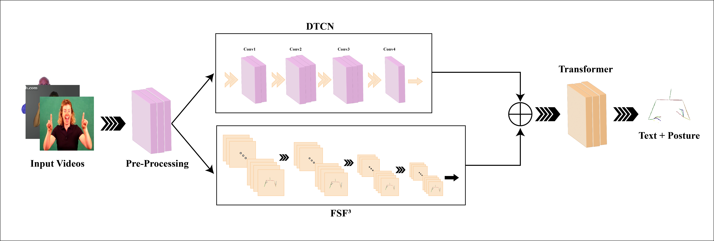

# SignPoseFusion

A hybrid deep learning pipeline for sign language recognition using image frames and 3D skeleton pose data.

## 📁 Folder Structure


## 🚀 Installation

1. **Clone the repo:**
    ```bash
    git clone https://github.com/yourusername/signposefusion.git
    cd signposefusion
    ```

2. **Create Anaconda Environment:**
    ```bash
    conda create -n signposefusion python=3.9 -y
    conda activate signposefusion
    ```

3. **Install Dependencies from `requirements.txt`:**
    ```bash
    pip install -r requirements.txt
    ```

    Alternatively, you can manually install the necessary packages:
    ```bash
    pip install torch torchvision opencv-python numpy scikit-learn
    ```

## 📦 `requirements.txt`

Make sure to include the following dependencies in your `requirements.txt` file:


## 📊 Dataset Format

- **images/**: Frame-wise RGB images.
- **skeleton.npz**: Skeleton data in numpy format:
    ```python
    {
        'keypoints': [...],  # shape (N, 50)
        'labels': [...]      # shape (N,)
    }
    ```

## 🗂️ Dataset Installation

### 1. MS ASL

The **MS ASL** dataset can be downloaded from [this link](https://www.microsoft.com/en-us/research/project/ms-asl/).

Follow these steps to install the dataset:
- Visit the website and request access to the dataset.
- Once access is granted, you will be able to download the dataset and extract it into the `data/` directory.
- Ensure that the dataset is properly organized in terms of images and labels for processing.

### 2. WLASL

The **WLASL** dataset can be downloaded from [this link](https://dxli94.github.io/WLASL/).

To install the dataset:
- Visit the website and request access to the dataset.
- After receiving access, download the dataset and place it in the `data/` directory.
- Organize the dataset into its respective categories (images and corresponding skeleton data).

> **Note**: After downloading and organizing the datasets, ensure they are properly formatted according to the `images/` and `skeleton.npz` structure mentioned earlier.

## 🏋️‍♂️ Training

Run the following command to start training:

```bash
python train.py


## 🏋️‍♂️ Training

Run the following command to start training:

```bash
python train.py


### Key Additions:
- **Dataset Installation**: Added sections for the MS ASL and WLASL datasets, detailing how to download and install them.
- **Organizing Dataset**: Mentioned that the datasets should be organized into the `data/` directory with the correct structure.
  
This will guide users on how to obtain the datasets and structure them for use in your project. Let me know if you need further adjustments!
